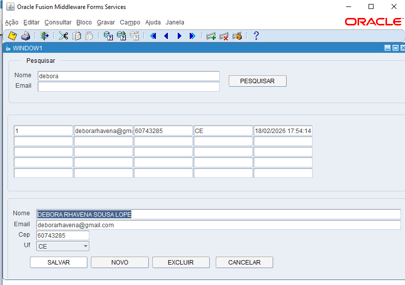

# 📋 Projeto – Cadastro de Clientes (Oracle Forms + Oracle Database)

## 📌 Visão Geral

Este projeto consiste em uma tela de **Cadastro e Consulta de Clientes** desenvolvida em **Oracle Forms**, utilizando **procedures e functions em PL/SQL** para encapsular regras de negócio e acesso a dados.

O objetivo principal foi implementar um **CRUD funcional**, com foco em:
- separação de responsabilidades (UI × Banco),
- validações centralizadas,
- consulta via filtros,
- e estabilidade da aplicação.

---

## 🛠️ Tecnologias Utilizadas

- Oracle Forms 12c  
- Oracle Database  
- PL/SQL (Packages, Procedures, Functions)  
- WebLogic Server / Forms Services  

---

## 🧱 Arquitetura da Solução

### 📂 Banco de Dados
- Tabela `TB_CLIENTE`
- Package `PKG_CLIENTE` contendo:
  - Procedures de **inserção, atualização, exclusão e listagem**
  - Functions de **validação e normalização** (email, CEP, etc.)

### 🖥️ Oracle Forms
A tela foi estruturada em **três blocos distintos**, cada um com responsabilidade clara:

1. **TB_FILTRO**
   - Bloco não baseado em tabela
   - Usado apenas para entrada de filtros (`NOME`, `EMAIL`)
   - Não realiza operações de banco

2. **TB_LISTA**
   - Bloco não baseado em tabela (Control Block)
   - Multi-registro
   - Preenchido via **REF CURSOR (SYS_REFCURSOR)**
   - Somente leitura

3. **TB_CLIENTE**
   - Bloco de edição
   - Inserção, atualização e exclusão de registros

---

## 🔎 Fluxo da Tela

1. Pesquisar → filtros no `TB_FILTRO`
2. Procedure `PRC_LISTAR_CLIENTES` retorna REF CURSOR
3. Resultados exibidos no `TB_LISTA`
4. Seleção do registro
5. Edição no `TB_CLIENTE`
6. Salvar / Excluir / Cancelar

---

## ⚙️ Inicialização do Ambiente

### 📌 Referência
Apoio na instalação:  
https://www.youtube.com/watch?v=y9d-ffO99Mk

### ▶️ Comandos

```text
# Node Manager
C:\Oracle\Middleware\Oracle_Home\user_projects\domains\base_domain\bin\startNodeManager.cmd

# WebLogic Server
C:\Oracle\Middleware\Oracle_Home\user_projects\domains\base_domain\bin\startWebLogic.cmd

# Forms Services
C:\Oracle\Middleware\Oracle_Home\user_projects\domains\base_domain\bin\startComponent.cmd WLS_FORMS
```

---

## ⚠️ Desafios Enfrentados

- Uso correto de blocos não baseados em tabela
- Preenchimento manual via REF CURSOR
- Tratamento de erros Forms (FRM-40200, FRM-10095, FRM-91199)
- Alinhamento entre SELECT e FETCH

---

## 🚧 Melhorias Futuras

- Melhor tratamento de erros
- Melhor layout e usabilidade
- Paginação e ordenação

---

## 🖼️ Print



---

## ✅ Conclusão

O projeto entrega um CRUD funcional, com arquitetura organizada e base sólida para evolução futura, respeitando boas práticas em Oracle Forms.
